# Звіт з Комп'ютерного Практикуму №1
## Тема: Базові команди в Linux
## Варіант: 6
## Виконав(ла): Подкур Надія
## Група: ІП-41


### Мета роботи:
Оволодіння практичними навичками роботи в системі Linux. Знайомство із структурою файлової системи, основними командами роботи з файлами.


### Хід роботи:

**1. Вхід в систему:**
  Команда: `login` (та введення логіну/паролю)
     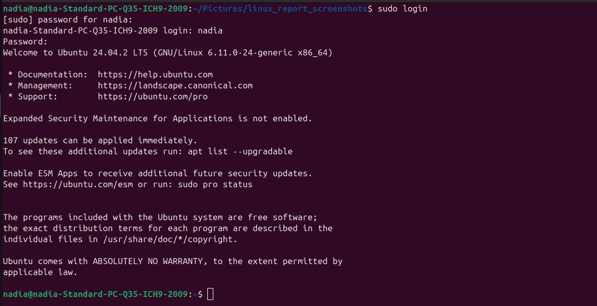

**2. Зміна пароля:**
  Команда: `passwd`
     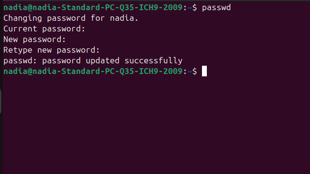

**3. Виведення системної дати:**
    Команда: `date`
     

**4. Підрахунок кількості рядків у файлі `/etc/crontab`:**
    Команда: `wc -l /etc/crontab`
     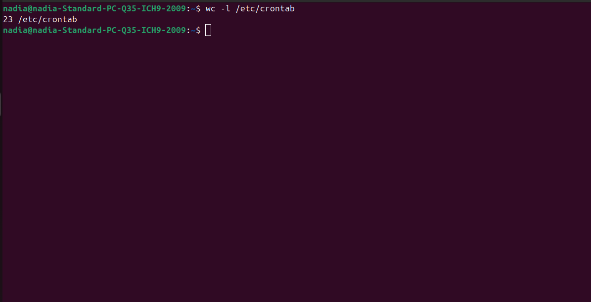

**5. Виведення вмісту файлу `/etc/crontab`:**
    Команда: `cat /etc/crontab` (або `more /etc/crontab`)
     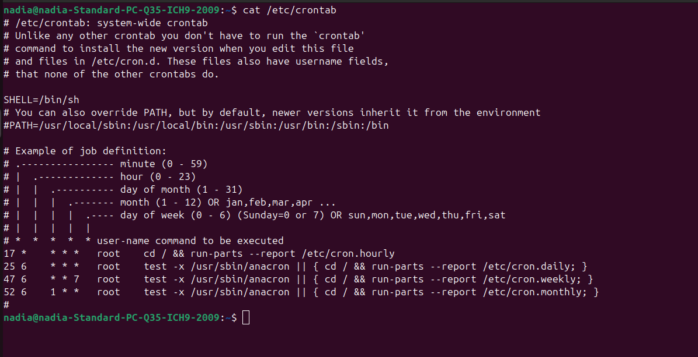

**6. Виведення календаря на 2016 рік:**
    Команда: `cal 2016`
     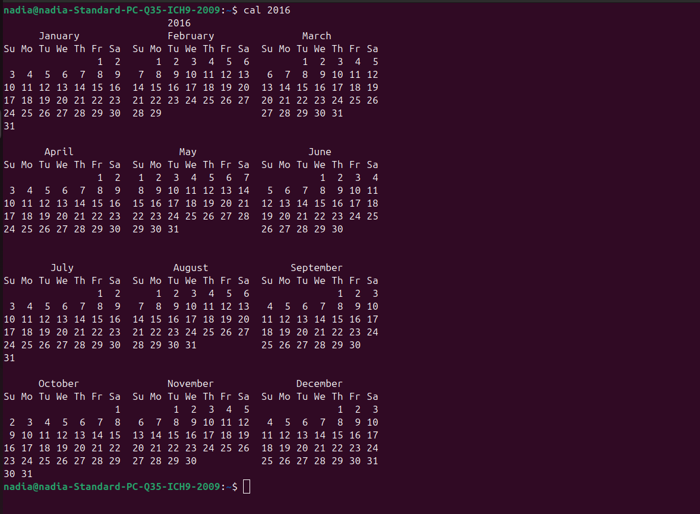

**7. Виведення календаря на 1752 рік та пояснення:**
    Команда: `cal 1752`
     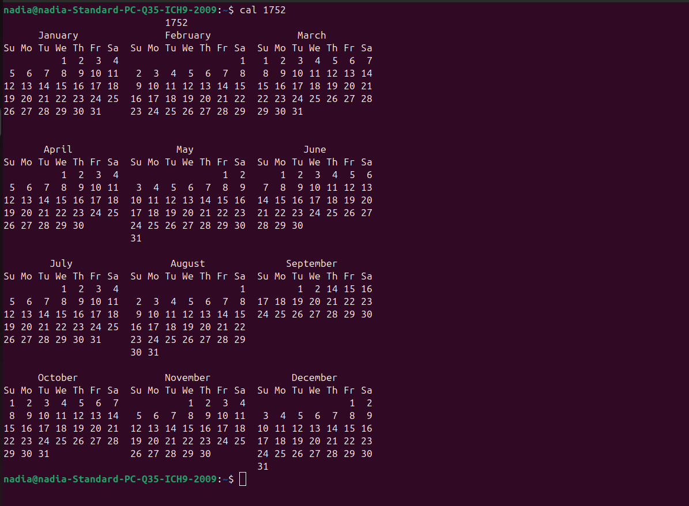
   - Пояснення: У вересні 1752 року відсутні дні з 3 по 13. Це пов'язано з переходом Великої Британії та її колоній (включаючи майбутні США) з Юліанського календаря на Григоріанський. Щоб синхронізувати календар з астрономічним роком, було необхідно "викинути" 11 днів.

**8. Демонстрація, хто ще завантажений у систему:**
    Команда: `who` (або `w`)
     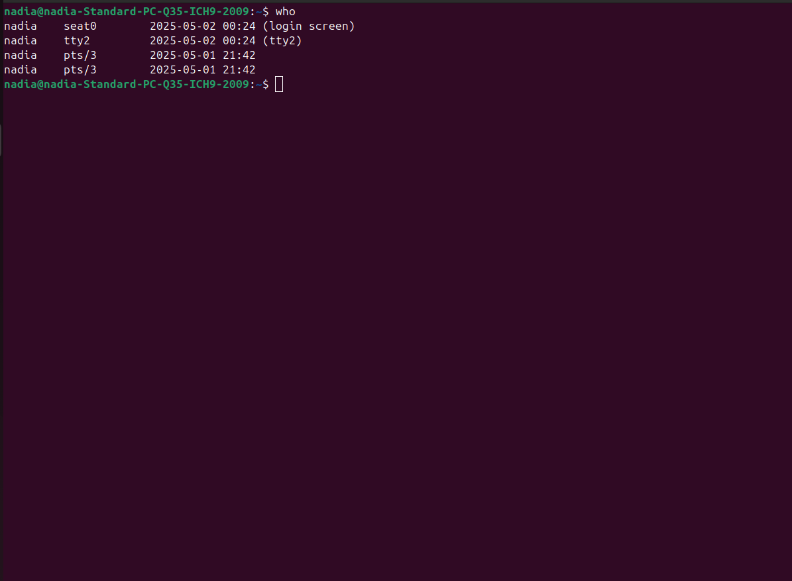

**9. Виконання команди `ping`:**
    Команда: `ping localhost`
     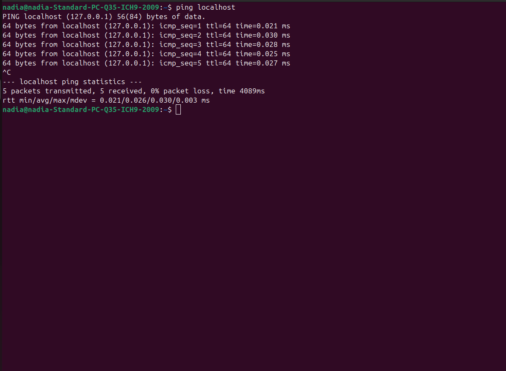
   - Пояснення: Команда `ping` надсилає ICMP ECHO_REQUEST пакети на вказану адресу (в даному випадку, `localhost`, тобто власний комп'ютер) для перевірки доступності вузла та вимірювання часу відповіді. Результат показує успішне отримання відповідей (ECHO_REPLY) від `localhost`.

**10. Копіювання файлів `/bin/date` та `/bin/more` у домашній каталог:**
    Команди:     `cp /bin/date ~ сp /bin/more ~/my_more_copy`
      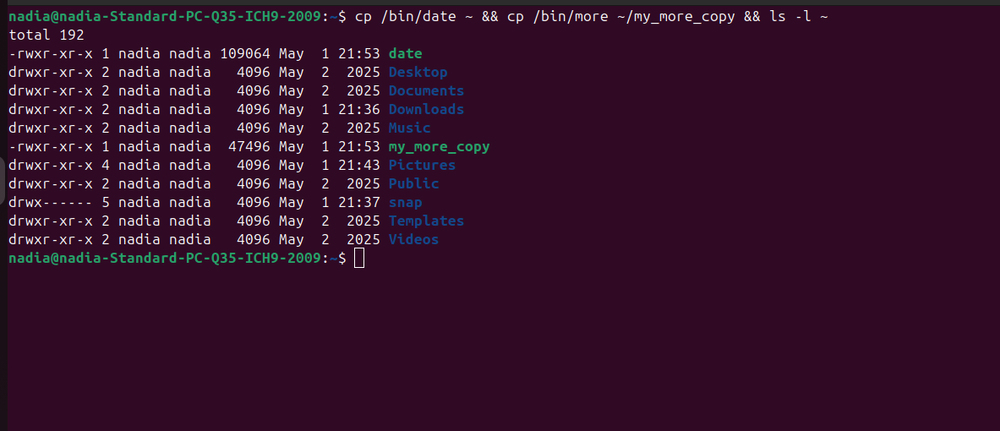


**11. Створення каталогу `workshop_1`:**
    Команда: `mkdir workshop_1`
      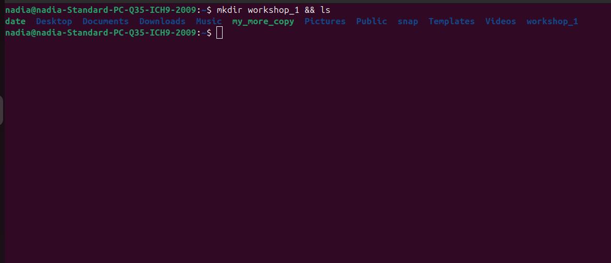

**12. Копіювання та переміщення файлів у `workshop_1`:**
    Команда: ```cp ~/date workshop_1/tu_date && mv ~/my_more_copy workshop_1/tu_more && ls workshop_1```
      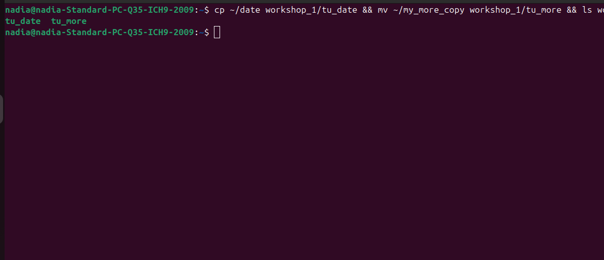

**13. Перевірка домашнього каталогу:**
    Команда: ```cd ~ ls -l ls -l workshop_1```
      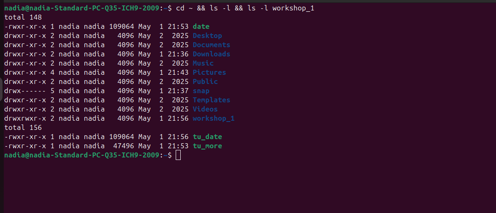
    - Пояснення: Переконалися, що вихідні файли (`date`, `my_more_copy`) відсутні в домашньому каталозі (оскільки один скопійовано, а інший переміщено), а в каталозі `workshop_1` знаходяться файли `tu_date` та `tu_more`.

**14. Створення каталогу `workshop_1_6` та перехід в нього:**
    Команда: ``` mkdir workshop_1_6 cd workshop_1_6 pwd ```
      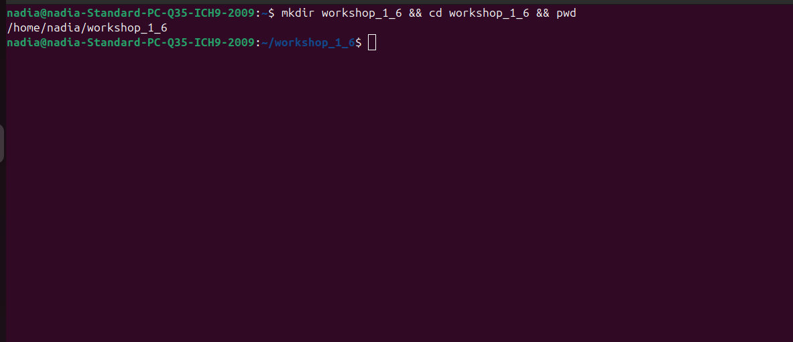

**15. Копіювання файлу `/etc/crontab` у `workshop_1_6` під ім'ям `crontab`:**
    Команда: `cp /etc/crontab ./crontab`
      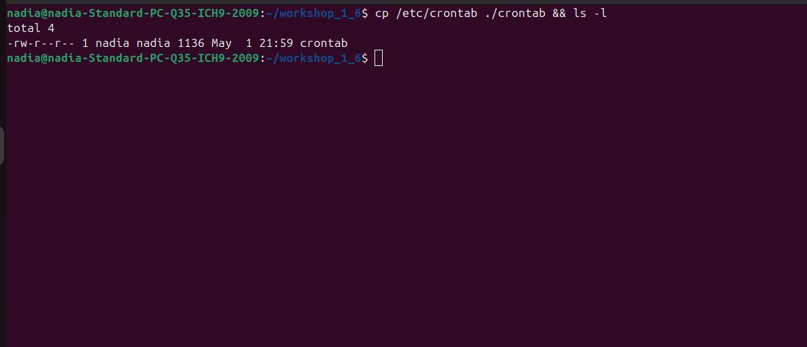

**16. Перегляд вмісту скопійованого файлу за допомогою `cat` і `less`:**
    Команди: ```cat ./crontab less ./crontab```
      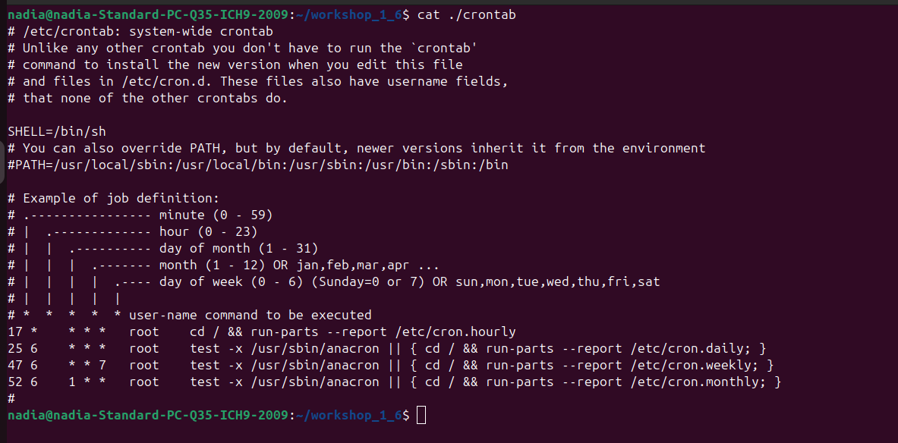
      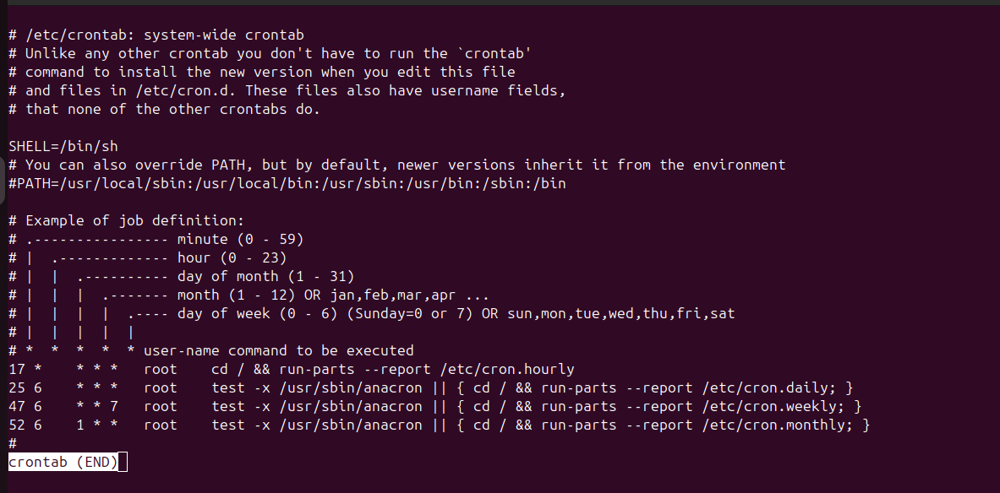

**17. Перехід у свій домашній каталог:**
    - Команда: `cd ~ && pwd`
      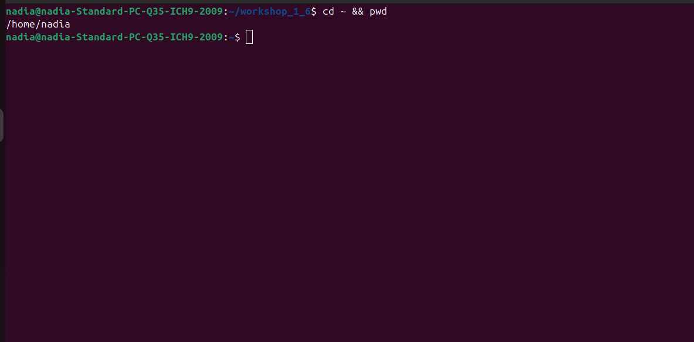

**18. Видалення каталогу `workshop_1_6`:**
    - Команда: `rm -r workshop_1_6`
      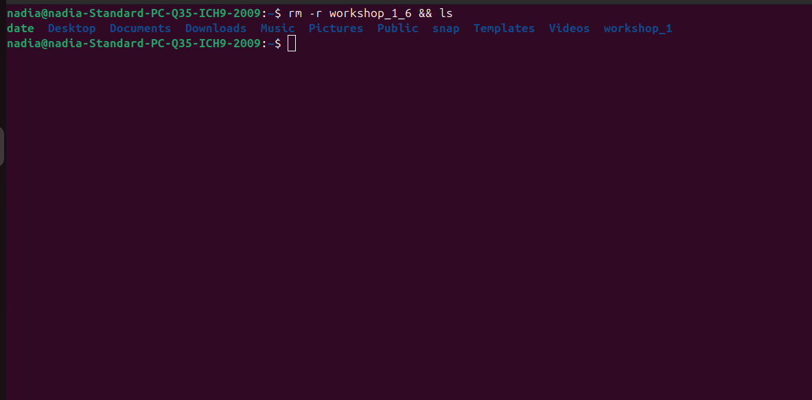


### Висновки:
Під час виконання комп'ютерного практикуму №1 я ознайомилась з основними командами операційної системи Linux для роботи з файловою системою, файлами та каталогами. Були отримані практичні навички використання команд `passwd`, `date`, `wc`, `cat`, `more`, `less`, `cal`, `who`, `ping`, `cp`, `mv`, `mkdir`, `rm`, `rmdir`, `cd`, `ls`, `pwd`. Я навчилась переглядати вміст файлів, копіювати, переміщувати та видаляти файли і каталоги, а також отримувати системну інформацію. Було досліджено особливості календаря за 1752 рік, пов'язані зі зміною календарних систем.
